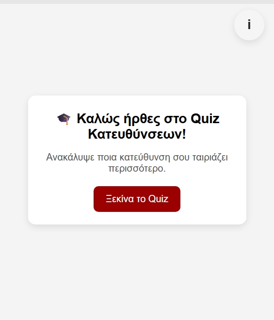
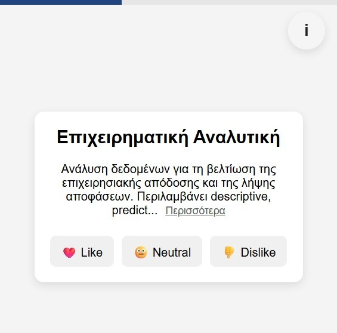

# Ionian Univeristy Greece Directions for Informatics
Inoinan Universtity Choose Direction Quiz

## Languages
- [Greek](#greek)
- [English](#english)

    

---

## Greek
 

## Τί αλλαξε:
🎓 Το Ιόνιο Πανεπιστήμιο προχώρησε από το έτος 2025-2026 σε ριζική **αναδιάρθρωση του προγράμματος σπουδών**, με αποτέλεσμα να αλλάξουν τα μαθήματα και οι ακαδημαϊκές κατευθύνσεις. Αυτή η αλλαγή προκάλεσε αβεβαιότητα στους φοιτητές, ειδικά όσους βρίσκονται στις πρώτες φάσεις των σπουδών τους και προσπαθούν να βρουν το κατάλληλο μονοπάτι που ταιριάζει στα ενδιαφέροντά τους και στους στόχους τους.

## Γιατί δημιουργήθηκε;
💡 Με αφορμή αυτή την ανανέωση, δημιουργήθηκε το παρόν quiz-website που δίνει τη δυνατότητα στους φοιτητές να **επιλέγουν μαθήματα** ανάλογα με τις προσωπικές τους προτιμήσεις (αν τους αρέσουν ή όχι), και βάσει των απαντήσεών τους, η εφαρμογή ροτείνει την **καταλληλότερη κατεύθυνση σπουδών**. Η διαδικασία είναι απλή, διαδραστική και έχει ως στόχο να προσφέρει μια πρώτη καθοδήγηση σε έναν κόσμο νέων επιλογών.

## Πως λειτουγρουν τα αποτελέσματα;
📊 Τα αποτελέσματα που παρουσιάζονται είναι:
 1. **διάγραμμα:**   
 που απεικονίζει τα ενδιαφέροντα του χρήστη και έχει συμβουλευτικό χαρακτήρα. 
 2. Το **τελικό αποτέλσμα:**   
 εμφανίζεται κάτω απο το διάγραμμα και λειτουργεί με βάση τις παραμέτρους και τη δομή του νέου προγράμματος σπουδών. 
 3. Για **λεπτομέρειες** στον τρόπο που βγήκε το αποτέλσμα σχετικά με την αντιστοίχιση των κατευθύνσεων, υπάρχει διαθέσιμο εικονίδιο **“i”** επάνω δεξιά, που ανοίγει έναν βοηθητικό πίνακα με το αποτέλεσμα κάθε επιλογής.
 4. Δυνατότητα **Κοινωποίησγης Αποτεσμάτων** (Μόνο για Android & Windows)

## Υποστηριζόμενη browers χωρίς προβλήματα
|Brower | Υποστηριζόμενη έκδοση|
|--------|---------|
| Google Chrome| Chrome 32+|
|Firefox |3.5+ |
|Opera| 12+ |
|Microsoft Edge|EdgeHTML & Chromium-based|
|Safari| 6+ |

 

---

 

## English

## What Changed:

🎓 Starting from the academic year 2025–2026, the Ionian University implemented a **major curriculum reform**, reshaping the courses and academic pathways offered. This change brought uncertainty, especially for students in their early years of study who are trying to discover the right academic path that matches their interests and future goals.

## Why Was This Created?

💡 In response to this shift, this quiz-based website was developed to help students **choose courses** based on their personal preferences (what they like or dislike). Based on their answers, the app recommends the **most suitable academic direction**. The process is simple, interactive, and designed to offer an initial sense of guidance in this new academic landscape.

## How Do the Results Work?
📊 The results are presented in the following way:
1. **Graph visualization:**
   Displays the user’s interests in a consultative, visual format.
2. **Final result:**
   Shown below the graph this is generated based on the structure and rules of the new curriculum.
3. **Detailed breakdown:**
   An **“i” info icon** (top-right) opens a reference table that shows how each choice contributed to the final recommendation.
4. **Sharing feature:**
   Users can **share their results** (Available on Android & Windows only).

## Browser Compatibility

| Browser        | Supported Version         |
| -------------- | ------------------------- |
| Google Chrome  | Chrome 32+                |
| Firefox        | 3.5+                      |
| Opera          | 12+                       |
| Microsoft Edge | EdgeHTML & Chromium-based |
| Safari         | 6+                        |

